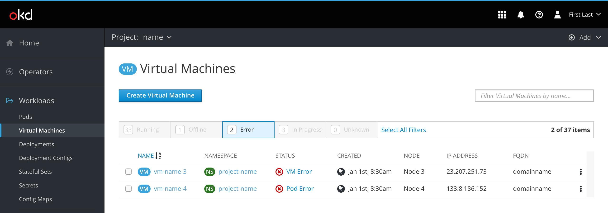
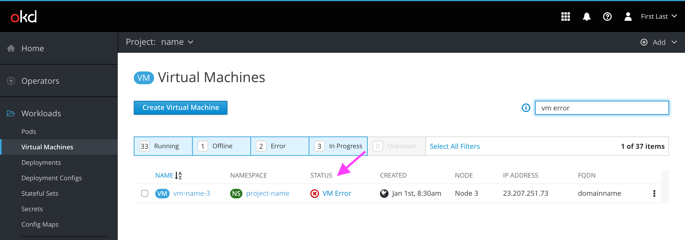
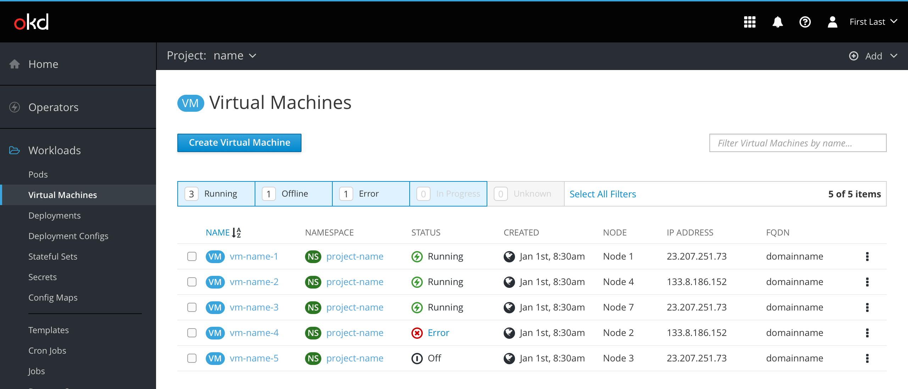
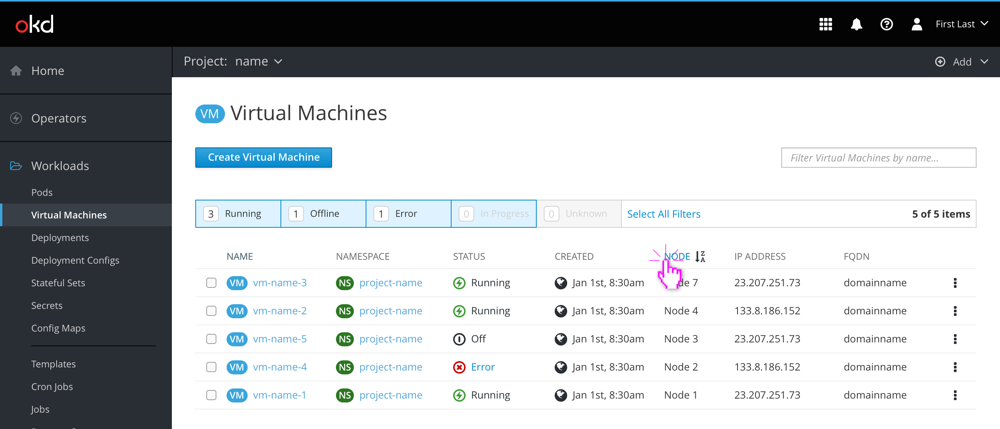
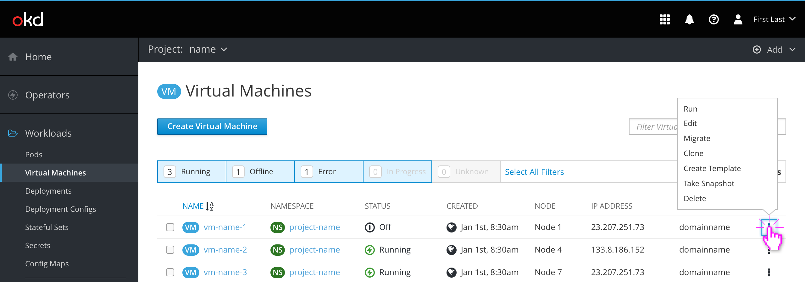
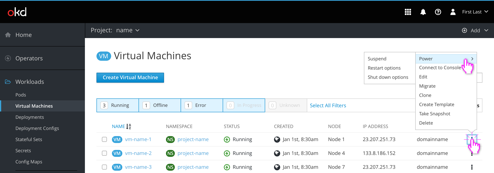
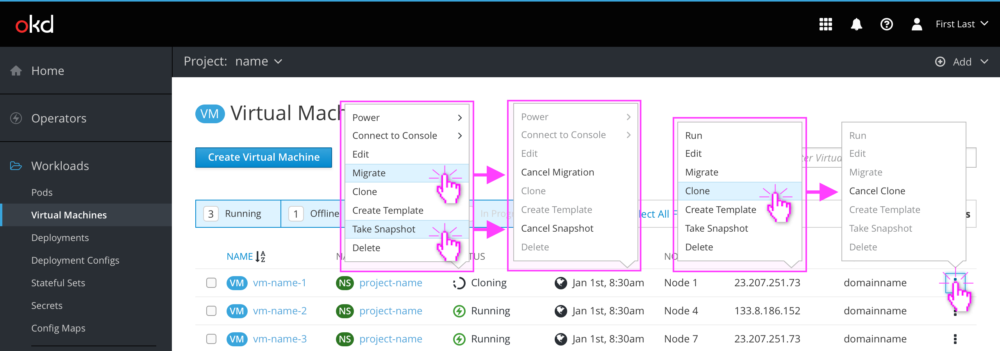

# VM List

The VM list contains columns for the following:
- Name
- Namespace
- Status
  - Running, Off, Error (with custom messages), Cloning, Migrating, Importing, Warning, Pending (with changes that will apply after restart), Unknown
- Created
  - Date formatting should follow OpenShift's console, viewable [here](https://github.com/openshift/console/blob/master/frontend/public/components/utils/timestamp.jsx) and [here](https://github.com/openshift/console/blob/master/frontend/public/components/utils/datetime.ts)
  - If possible, a tooltip should appear on hover with the exact creation date, including year.
- Node
- IP Address
- FQDN

## Status tooltips

Statuses other than Running or Off should be colored blue to indicate that they can be hovered and/or clicked.

Hovering over a blue status should display a tooltip with a brief description of the issue or underlying process. If multiple errors/warnings exist, the description should be more generic. Clicking on a blue status should bring the user to the VM's Events page for more details.

## Filtering

### Item filters

The predefined filters in the filter bar can be used to narrow the VM list by most statuses. The user clicks each filter to toggle it on and off.

### Name filter

The name filter can also be used to further narrow down the VM list. Name filters do not override the filters set in the filtering bar, meaning hidden items will remain hidden even if searched for.

(Note: This behavior could be a usability issue if users expect the title filter input to behave like a traditional search input.)

### Search filter (concept)

If possible, the name filter could become a traditional search filter instead, allowing the user to filter results by any text string in any column. This could enable users to quickly find a VM by IP address, FQDN, or possibly other fields in the future. Multiple filters could be delineated by a comma in the search query. A help icon describing this advanced functionality would likely be necessary.

## Sorting

VM lists are sorted alphabetically by name by default. Clicking on a different column title will sort that column the same way. Clicking on the same column title twice will reverse the sort direction.

## States and Actions

When a VM is off, the actions kebab contains options to Run, Edit, Migrate, Clone, Create Template, Take Snapshot, and Delete the VM.

When a VM is running the Run option is replaced with two dropdowns for Power and Connect to Console.

The Power dropdown contains options to Suspend, Restart, or Shut down the VM. Because these are potentially destructive actions, clicking any of these options will display a modal for the user to confirm.

The modals for Restart and Shut down include an additional button to "Force" the action. They also include warnings about the possibility for data loss.

The Connect to Console dropdown contains quick links to the consoles that are enabled for the VM.

When a VM is in a transitional state (cloning, migrating, taking a snapshot, etc.) any unavailable actions in the kebab are disabled and the original action ("Clone") is replaced with a cancel action ("Cancel Clone").

