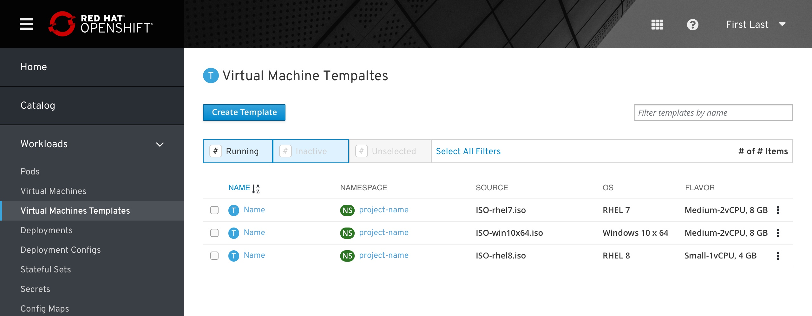
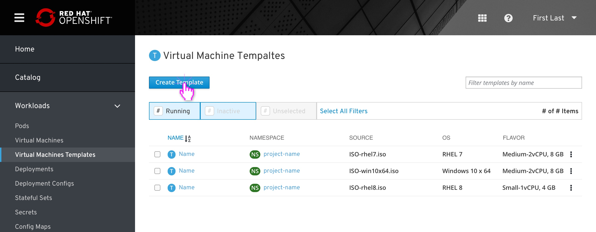
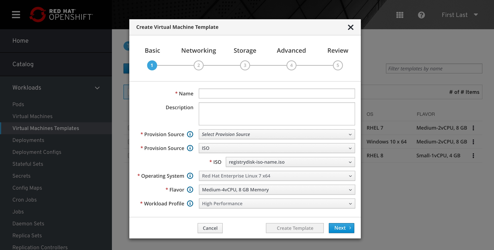
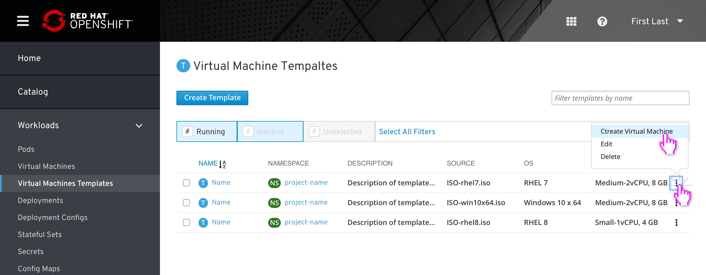
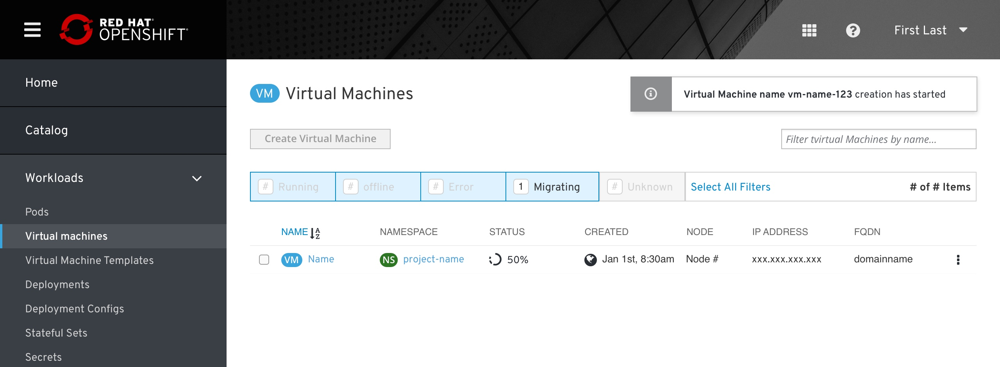

# Virtual machine templates

### Summary

- VM-templates is located at the main side menu, in 'Workloads' under 'virtual machines'.
- VM-templates displays a list view similar to VM list with minor changes in culoms and actions.
- From this List, the user can create a new template, create a virtual machine from a selected template, edit a selected template, or delete a selected template.
- Clicking on a template will bring the user to the template’s Overview tab (TBD).
Creating or editing a template will display a wizard similar to the “No Template state” wizard from Create VM but with slight adjustments.
- Users can also create templates based on existing VMs from the actions menu of any VM within the VM List View.

## Template list view

The user will be able to view a list of all templates that exist. From this List, the user can create a new template, create a virtual machine from a selected template, edit a selected template, or delete a selected template.

## Create template from primary button

Clicking “Create Template” will display a wizard similar to the “No Template state” wizard from Create VM but with slight adjustments.

1. Modal title changes to “Create Template”
2. “Template” is no longer a Provision Source option
3. The two checkboxes for “Start virtual machine on creation” and “Create new template from configuration” are removed
4. The quick action button at the bottom is now “Create Template”
5. In Step 5 “Review”, references to “Virtual Machine” are replaced with “Template”

    a. Create/Creating Virtual Machine -> Create/Creating Template

    b. Virtual Machine creation failed -> Template creation failed

    c. Virtual machine created successfully -> Template created successfully

Everything else remains the same.

## Create template from VM List

Users can also create templates based on existing VMs from the actions menu of any VM within the VM List View. 

The VM they choose pre-fills the Provision Source, OS, Flavor, Workload Profile, and all other Networking, Storage, and Advanced settings of the Create Template wizard.

## Create VM from another template

Users can initiate the Create VM wizard from the actions menu of a VM template.

The template they choose is preselected and the OS, Flavor, and Workload Profiles are filled in. Refer to the Create VM wizard for all other steps.

After successfully working through the Create VM Wizard, the user would be taken to the Virtual Machine List View to show the new VM creation progress.

## Template details (coming soon)

Clicking on a template will bring the user to the template’s Overview tab.

The YAML tab allows the user to edit the template’s configuration.

The Virtual Machines tab displays a VM List View with only the VMs that were created using the template. This list behaves mostly the same, but the actions kebab will likely need to be different (no Create Template button, for example)

## Editing a template (coming soon)

Likely brings up the same creation wizard, but with any mention of “Create” changed to “Save” instead.

