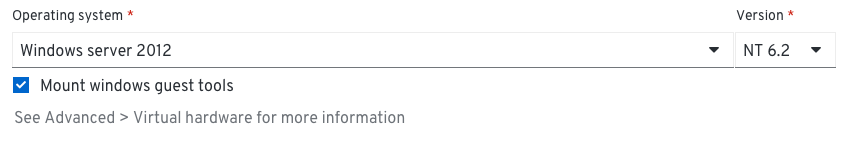
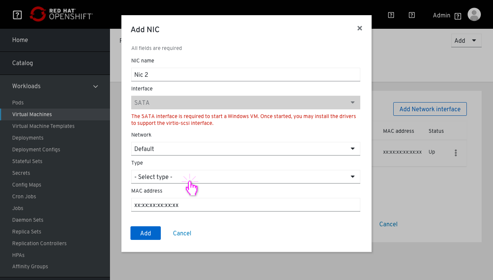
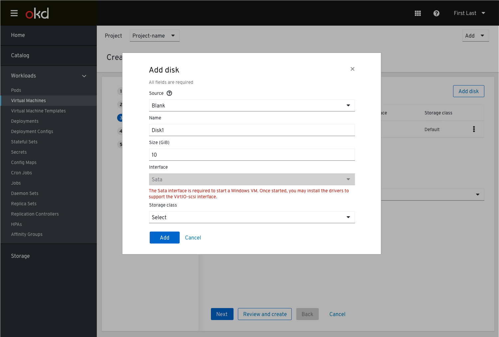
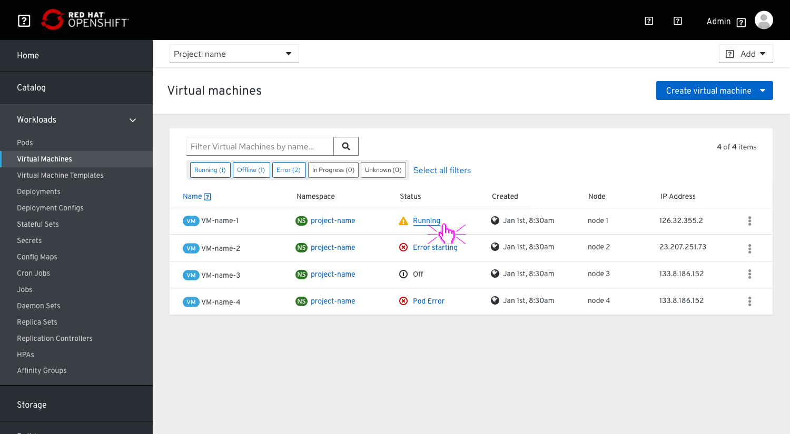
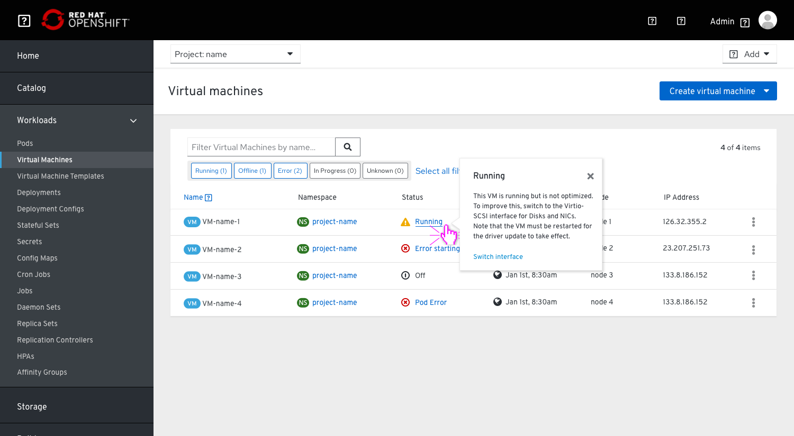
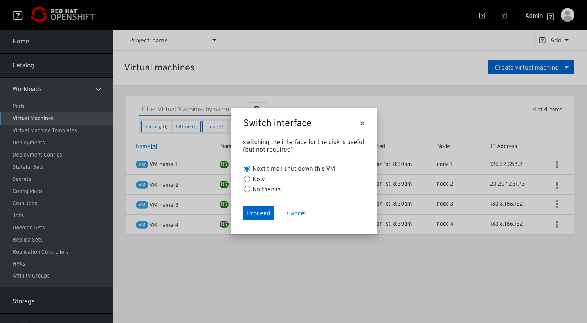
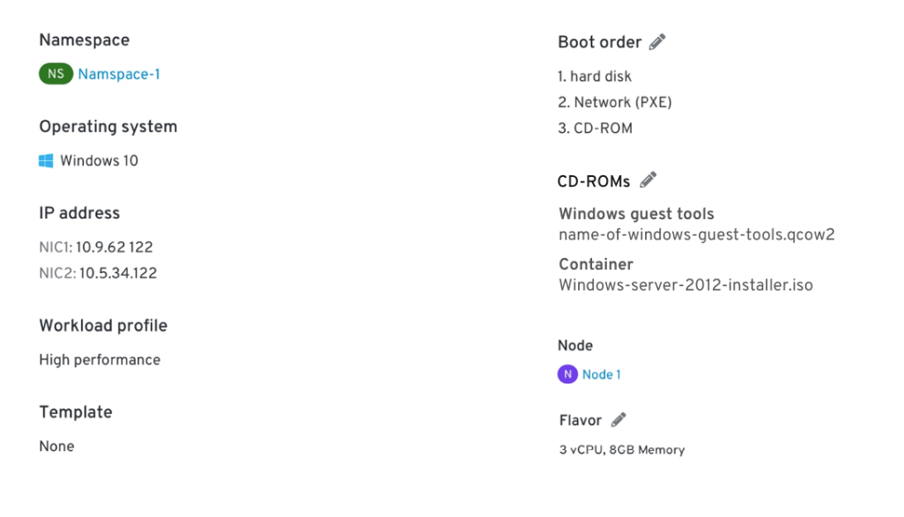

# Windows VMs

The purpose of this PR is to research the details of a Windows VM vs any other option currently available via CNV. It will also try to cover how a Windows VM impacts each step of creating a VM flow, as well as after the VM has been created and also actions that  a user can take to improve the operability of the Windows VM.

There are 3 main use cases for creating a windows VM:

- A developer who develops software on windows and needs good connection of the VM to other parts of OpenShift (e.g. he can have his DB in a pod for example) and quick/responsive RDP connection.

- End user that works with a software that is installed on a VM (and not on a personal laptop, f.e. due to different time zones.

- Server virtualization - Administrator that installs a server + Windows applications and manages them. This user is interested in the flexibility to configure the VM so it will fit his needs and performs as it should.

## Create VM flow  

1. When the user chooses windows OS from the Operating system drop down menu, they are notified that the Windows guest tools will be mounted which will then show in the Advanced step > virtual hardware (maybe we should label this as a CD-ROM?)

2. Storage and Networking steps

The main issue here is the drivers for the interface: The user needs Sata interface to set the VM but once they install the drivers they can switch to the Virtio-scsi interface.

So at first, since the interface would be prepopulated with IDE, the user will see the Sata interface (because that is the one needed to install Windows).

When a Windows VM is chosen, the disk interface will not be able to be Virtio-scsi because the VM will not have the drivers for it, so we need to advise the user to install the drivers after the VM has been created and then switch the interface from IDE to Virtio-scsi (to do this switch they will need to power off the VM).
The drivers needed for Virtio-scsi are available via the Windows Guest Agent which is available by default.

### Networking step

### Storage step

3. The user starts up the VM, then goes into Windows and installs the drivers.

4. In the list view the user sees that the VM is running but that they should now switch the interface to Virtio-scsi for better performance.

5. In the status popover they are provided with a “Switch interface” action. They will also be notified that the VM must be restarted for the driver update to take effect.

## Post creation steps

The users would need to be aware that switching the interface for the disk is useful (but not required). It’s important to note that it’s not required because they will not get an error stating there is an issue.

It seems reasonable to have a notification in the Storage step that advises them to make the update and then in the VM list to show that same notification under the status column.

By click a popover will show and provide an explanation

If they choose to switch Interfaces they will be asked when they choose to schedule it

### CD-ROMs

The user will see these guest tools in the VM details, under the overview tab in the ‘CD-ROM(s)’ section, and have the indication that Windows Drivers are installed.

This is done by default to ensure the proper drivers are available for the VM.
