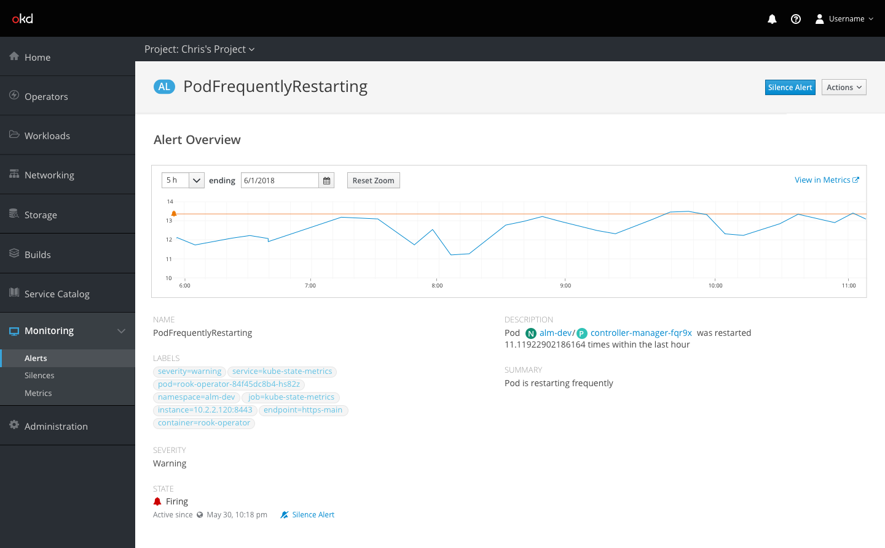
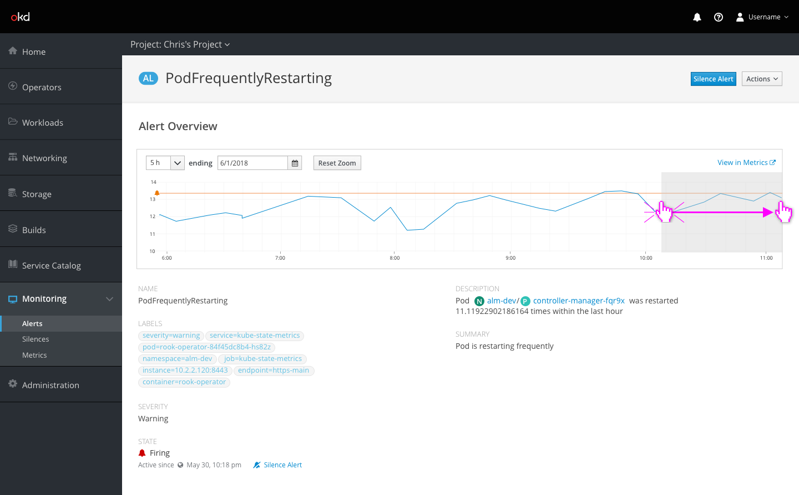
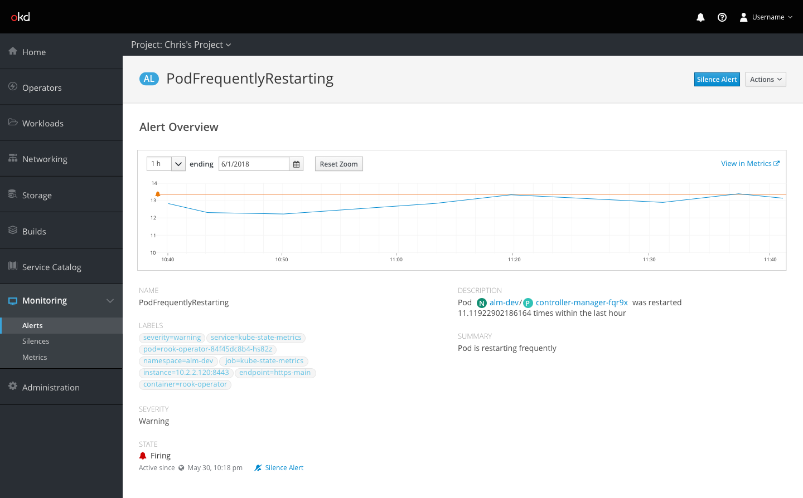

# Alerts

## Alert Metrics

- Initially the chart should be zoomed to a time period that at least includes the `for` attribute of the alert, but preferably 3-5 times that period as loading times allow
- An orange line with an alert icon (if possible) shows the firing threshold for the alert
- Clicking on the `View in Metrics` link takes the user to the metrics page (prometheus UI) and pre-populated with the relevant query for the alert

- Clicking and dragging on the chart should zoom in so that the selected area fills the chart view

- Zooming can also be done by typing or selecting a new time period above the chart
- Clicking the `reset zoom` button should reset the scale of the chart to the default based on the alert
