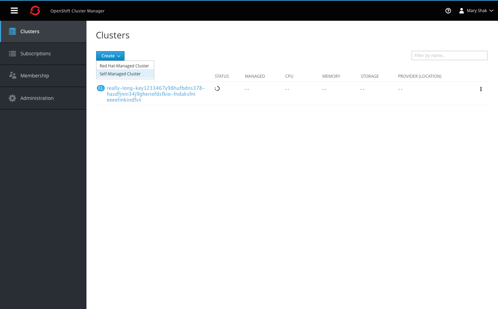
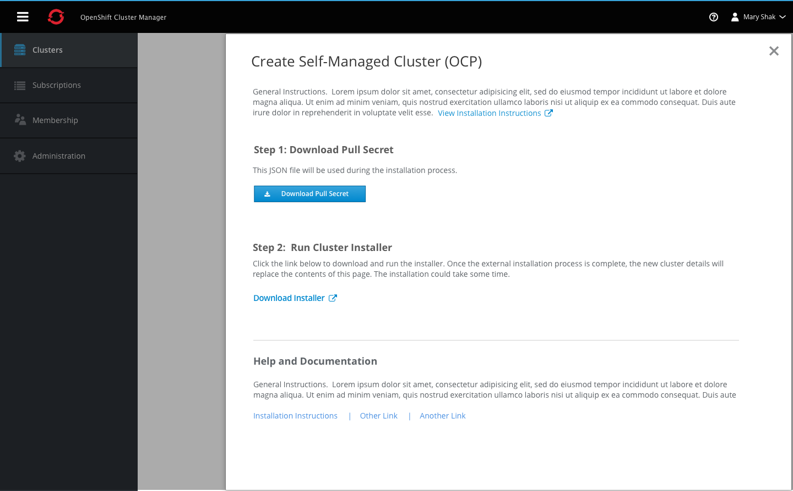

## Create Cluster

- The create action opens a dropdown with all options for creating a new clusters. All selections will open a modal side panel with step by step instructions for completing the creation.

### Self-Managed Cluster

- Clicking the create self managed cluster button will open a panel with information regarding the two-step process for installation.
- Users must download the JSON file in order to use it as an authorization token during the installation process.
- Once users follow the external installation process, the cluster will start to appear in the list in the background.
- Users can install additional clusters following the prompts in the side panel and once complete, they can close it using the X in the top right corner.

### Red Hat Managed Cluster

- Clicking the create Red Hat managed cluster button will open a panel with information regarding the two-step process for installation.
- Users must first provide credential information for the cloud provider and then enter the cluster configuration parameters to complete the process.
