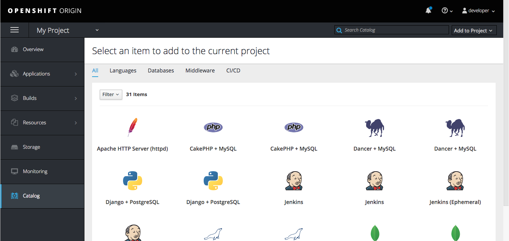

# In-project Catalog

- Users with permission to add to a project will see a `Catalog` option in the main navigation.
  - The Catalog menu should use `pficon-service-catalog`.
- Selecting `Catalog` navigates the user to a catalog of services that may be added to the current project.
- Users may also navigate to the Catalog via the `Browse Catalog` option in the [Add to Project](http://openshift.github.io/openshift-origin-design/web-console/project-details/add-to-project) dropdown menu.
- The look and behavior of the catalog categories and sub-categories are identical to the [Catalog](http://openshift.github.io/openshift-origin-design/web-console/homepage/catalog#browse-catalog) on the [Landing Page](http://openshift.github.io/openshift-origin-design/web-console/homepage/homepage).  
- The in-project catalog may also include templates or image streams that are specific to the current project, in addition to the catalog items a user sees on the landing page.
- Selecting an item from the catalog  will initiate the [ordering flow](http://openshift.github.io/openshift-origin-design/web-console/patterns/order-from-catalog).
- The only deviation from the ordering flow from the landing page is that a user is not given the option to select the project to add to on the Configuration step – the resource is added to the current project.
